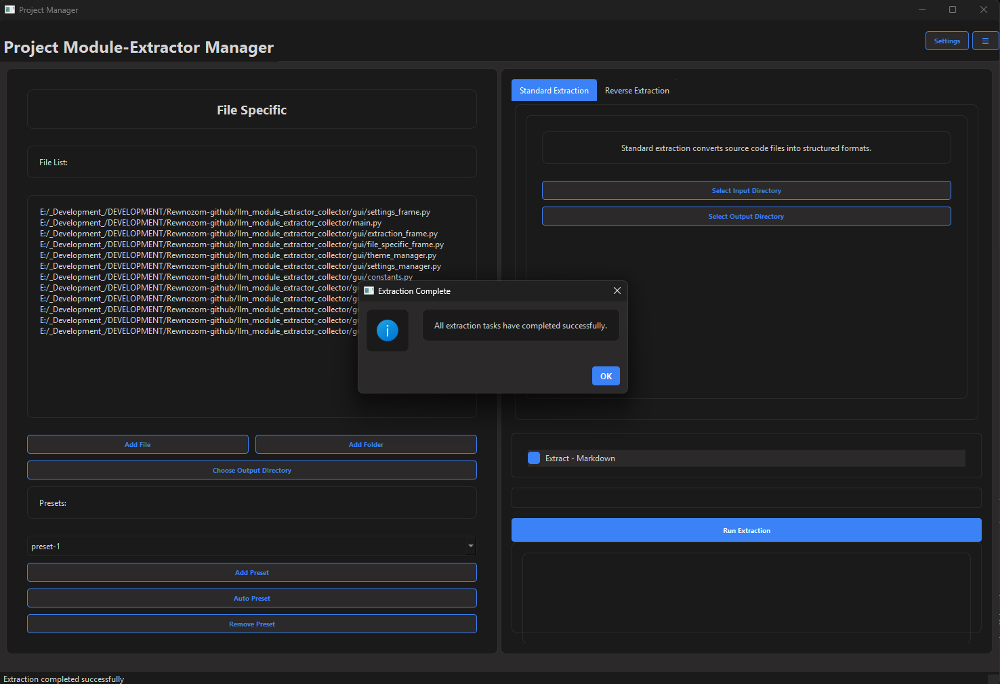

# **LLM Module Extractor & Collector (`llm_module_extractor_collector`)** 🚀

## 📌 **Overview**
**LLM Module Extractor & Collector** is a powerful and flexible tool designed to efficiently gather, manage, and organize modules and components for **working with Large Language Models (LLMs)**. It enables fast and optimized extraction of code-based components into **Markdown** or **CSV**, streamlining workflows and making it easier to manage modular structures using **presets**.


> see inside "./example/output/preset-1"

### 🚀 **Key Features:**
- **📂 Preset Management:** Create and manage different **presets** for specific modules or components.
- **📋 Automatic Extraction:** Collect all selected modules into a structured **Markdown** or **CSV** file.
- **🛠 Custom Ignoring Rules:** Define which files, folders, and extensions should be excluded.
- **🔄 Auto Scan Feature:** Generate presets automatically based on project structure.
- **⚡ Optimized Workflow:** Makes it easier to reuse and quickly retrieve code blocks when working with LLMs.

---

## 🛠 **Installation**
### **1. Clone the repository**
```bash
git clone https://github.com/your-username/llm_module_extractor_collector.git
cd llm_module_extractor_collector
```

### **2. Install dependencies**
```bash
pip install -r requirements.txt
```

---

## 🔧 **Configuration (`settings.toml`)**
This tool uses a **settings.toml** file for paths, presets, and other configurations.

### **Example `settings.toml`**
```toml
[paths]
base_dir = ""  # Root directory of the project
output_dir = ""  # Directory where extracted files will be saved
select_csv_reverse_file = ""
select_csv_output_reverse_dir = ""
select_markdown_reverse_file = ""
select_markdown_output_reverse_dir = []
path_style = "windows"

[files]
ignored_extensions = [".exe", ".dll"]  # File extensions to ignore
ignored_files = ["file_to_ignore.txt"]  # Specific files to ignore

[directories]
ignored_directories = ["dir_to_ignore"]  # Directories to exclude

[file_specific]
use_file_specific = false  # Enable or disable file-specific settings
specific_files = [""]

[output]
markdown_file_prefix = "Full_Project"  # Prefix for Markdown exports
csv_file_prefix = "Detailed_Project"  # Prefix for CSV exports

[metrics]
size_unit = "KB"  # Unit of measurement for file size

[presets]
Preset-1 = []  # Empty preset, can be filled during use
```

---

## 🚀 **Usage**
### **Run the GUI**
Start GUI with:
```bash
python main.py
```

### **Adding Files to a Preset**
- Click **"Add File"** to select specific files.
- Click **"Add Folder"** to add all files from a selected folder.
- Click **"Choose Output Directory"** to set the export destination.

### **Managing Presets**
- Create a new preset using **"Add Preset"**.
- Remove an existing preset using **"Remove Preset"**.
- Use **"Auto Preset"** to automatically create presets based on the project’s file structure.

### **Export to Markdown / CSV**
1. Select a preset from the list.
2. Click **"Export to Markdown"** or **"Export to CSV"**.
3. The file will be saved in the output directory as per your settings.
